# Amazonia 360 - Project Architecture UML

```mermaid
classDiagram
    %% Next.js Application Layer
    class NextApp {
        <<Next.js Application>>
        +manifest.ts
        +middleware.ts
        +env.mjs
    }

    %% Frontend Layer
    class Frontend {
        <<Route Group>>
        +[locale] routes
        +home page
        +report page
        +auth routes
    }

    %% CMS/Payload Layer
    class PayloadCMS {
        <<CMS Backend>>
        +admin panel
        +collections
        +migrations
        +cron jobs
    }

    %% Services Layer
    class APIService {
        +AXIOS_INSTANCE
        +API() Promise~T~
        +baseURL
        +authentication
    }

    class SDKService {
        +SDK methods
        +API integrations
    }

    %% CMS Collections
    class Admins {
        <<Collection>>
        +id: UUID
        +email: string
        +authentication
    }

    class Users {
        <<Collection>>
        +id: UUID
        +profile data
        +reports
    }

    class AnonymousUsers {
        <<Collection>>
        +id: UUID
        +session data
        +temporary reports
    }

    class Reports {
        <<Collection>>
        +id: UUID
        +user_id
        +data
        +status
    }

    class Media {
        <<Collection>>
        +id: UUID
        +file data
        +metadata
    }

    class Accounts {
        <<Collection>>
        +id: UUID
        +user_id
        +provider data
    }

    %% Containers (Feature Components)
    class MapContainer {
        +mapInstance
        +layers
        +interactions
        +basemaps
    }

    class ResultsContainer {
        +data visualization
        +filters
        +charts
        +disclaimer
    }

    class HeaderContainer {
        +navigation
        +user menu
        +locale switcher
    }

    class FooterContainer {
        +links
        +partners
        +info
    }

    class ReportContainer {
        +report generation
        +data export
        +visualization
    }

    class IndicatorsContainer {
        +indicator display
        +data filtering
        +calculations
    }

    class WidgetsContainer {
        +widget management
        +dynamic rendering
    }

    class AuthContainer {
        +login
        +signup
        +authentication
    }

    %% UI Components Layer
    class UIComponents {
        <<shadcn/ui>>
        +Button
        +Card
        +Dialog
        +Form
        +Input
        +Select
        +etc.
    }

    class MapComponents {
        +MapGL
        +LayerManager
        +Legend
        +Controls
    }

    class ChartComponents {
        +BarChart
        +LineChart
        +PieChart
        +Visualization
    }

    %% Library Layer
    class LibUtilities {
        +formats
        +images
        +indicators
        +topics
        +subtopics
        +map utils
        +query helpers
        +report utils
    }

    class AILib {
        +AI integrations
        +ML models
    }

    class AuthLib {
        +authentication
        +authorization
        +session management
    }

    %% Data Layer
    class PostgresDB {
        <<Database>>
        +users table
        +reports table
        +media table
        +migrations
    }

    class Types {
        <<TypeScript>>
        +indicator.ts
        +topic.ts
        +generated types
        +payload-types.ts
    }

    %% External Services
    class ArcGIS {
        <<External API>>
        +mapping services
        +spatial analysis
    }

    class DeckGL {
        <<WebGL Library>>
        +3D visualizations
        +layers
        +effects
    }

    class AWS_SES {
        <<Email Service>>
        +send emails
        +templates
    }

    %% i18n Layer
    class I18N {
        +navigation
        +routing
        +translations
        +request handling
    }

    %% Relationships
    NextApp --> Frontend : contains
    NextApp --> PayloadCMS : contains
    NextApp --> I18N : uses

    Frontend --> MapContainer : renders
    Frontend --> ResultsContainer : renders
    Frontend --> HeaderContainer : renders
    Frontend --> FooterContainer : renders
    Frontend --> ReportContainer : renders
    Frontend --> IndicatorsContainer : renders
    Frontend --> AuthContainer : renders

    MapContainer --> MapComponents : uses
    MapContainer --> ArcGIS : integrates
    MapContainer --> DeckGL : uses

    ResultsContainer --> ChartComponents : uses
    ResultsContainer --> WidgetsContainer : contains

    HeaderContainer --> UIComponents : uses
    FooterContainer --> UIComponents : uses
    AuthContainer --> UIComponents : uses
    AuthContainer --> AuthLib : uses

    MapContainer --> LibUtilities : uses
    ResultsContainer --> LibUtilities : uses
    IndicatorsContainer --> LibUtilities : uses
    ReportContainer --> LibUtilities : uses

    Frontend --> APIService : calls
    Frontend --> SDKService : uses
    Frontend --> Types : uses

    APIService --> Types : returns
    SDKService --> APIService : extends

    PayloadCMS --> Admins : manages
    PayloadCMS --> Users : manages
    PayloadCMS --> AnonymousUsers : manages
    PayloadCMS --> Reports : manages
    PayloadCMS --> Media : manages
    PayloadCMS --> Accounts : manages

    PayloadCMS --> PostgresDB : persists to
    Admins --> PostgresDB : stored in
    Users --> PostgresDB : stored in
    Reports --> PostgresDB : stored in
    Media --> PostgresDB : stored in

    Users --> Reports : has many
    Users --> Accounts : has many
    AnonymousUsers --> Reports : has many

    PayloadCMS --> AWS_SES : sends emails via

    AuthLib --> Users : authenticates
    AuthLib --> Admins : authenticates

    LibUtilities --> Types : uses
    AILib --> Types : uses
```

## Architecture Overview

This UML diagram represents the architecture of the Amazonia 360 application, a Next.js-based platform with integrated PayloadCMS.

### Main Components

**Application Core:**

- Next.js application with middleware and environment configuration
- Internationalization (i18n) support for multi-language routing

**Frontend Layer:**

- Locale-based routing
- Feature-rich containers for different functionalities

**Backend (PayloadCMS):**

- Self-hosted CMS with admin panel
- 6 collections: Admins, Users, AnonymousUsers, Reports, Media, Accounts
- Automated cron jobs for maintenance

**Data & Services:**

- PostgreSQL database
- API and SDK services for external communication
- Integration with ArcGIS, Deck.GL, and AWS SES

**UI Components:**

- shadcn/ui component library
- Custom map and chart components
- Reusable utilities library
